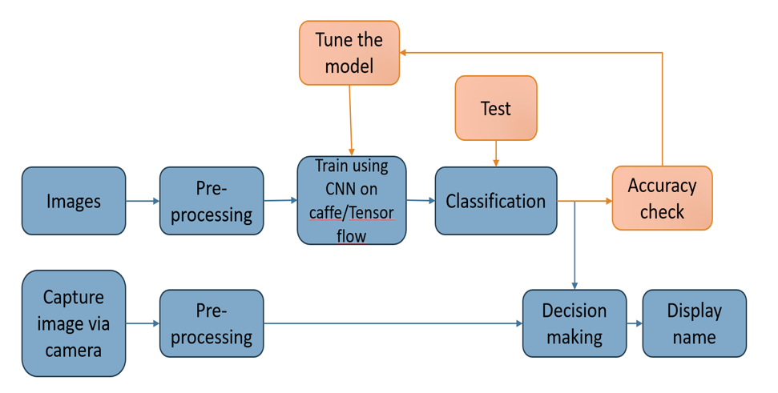

Face detection is a process of identifying human faces in a digital image.Face detection algorithms focus on detection of the  frontal areas of the face.”Facial recognition is a biometric software application capable of uniquely identifying or verifying a person by comparing and analyzing patterns based on the person's facial contours"

Project Architecture:

