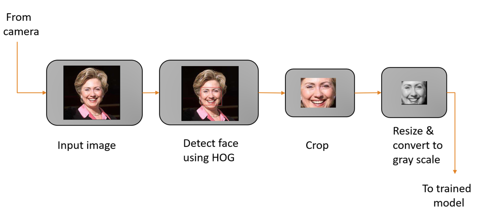
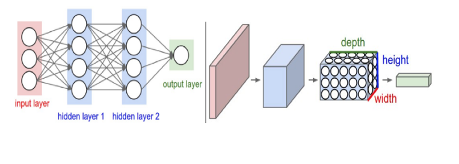
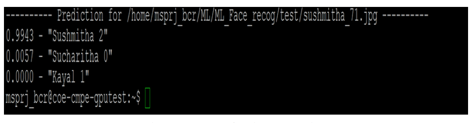

Introduction

Face Detection is a process of identifying human faces in a digital image. Face Detection algorithms focus on detection of the  frontal areas of the face.”Facial Recognition is a biometric software application capable of uniquely identifying or verifying a person by comparing and analyzing patterns based on the person's facial contours"

**Project Architecture**

**Precprocessing the images**

**CNN Architecture**

**Tools used**

Python
Tensor Flow
Docker
OpenCV

**Results**

Model Acuracy

Predcition acuracy for class Susmita

